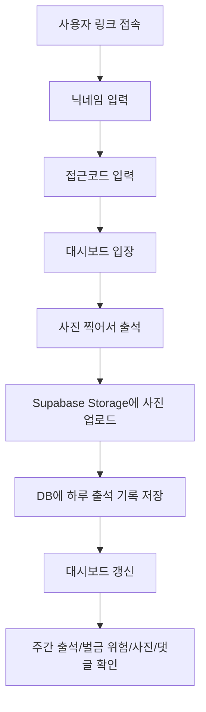

# 동민PT 운동 출석판

친구/소규모 PT 모임에서 **모바일로 운동 인증 사진을 찍고**, 이번 주 출석 횟수와 벌금 위험 상태를 같이 보는 운동 출석 서비스입니다.

이 레포에는 두 가지 버전이 함께 있습니다.

| 구분 | 위치 | 상태 | 설명 |
| --- | --- | --- | --- |
| Managed Web App | `apps/workout-checkin/` | 현재 권장 | Next.js + Supabase 기반 모바일 출석판 |
| GitHub Pages Prototype | `docs/` | 기존 프로토타입 | GitHub 레포를 저장소처럼 쓰는 정적 게시판 |

현재 실제 운영/배포 기준은 **`apps/workout-checkin`의 Managed Web App**입니다.

---

## 1. 서비스 한 줄 요약

> 친구들이 링크로 접속해서 닉네임과 접근코드로 들어가고, 모바일 카메라로 운동 사진 한 장을 찍으면 하루 1회 출석 처리되는 운동 출석판.

핵심 목표는 복잡한 운동 앱이 아니라 **친구끼리 벌금 룰을 관리하는 가벼운 모바일 출석판**입니다.

---

## 2. 현재 적용된 MVP 기능

- 닉네임 + 접근코드 로그인
- 로그인 세션 90일 유지
- 모바일 기준 UI
- 카메라 촬영 기반 사진 출석
- 앨범 선택 버튼 제거
- 하루 1회만 출석 인정
- 이번 주 월요일 시작 기준 집계
- 주 3회 미만이면 벌금 위험 표시
- 오늘/이번 주 사진 보드
- 주간/월간 운동 캘린더
- 사진 상세 팝업
- 댓글/이모지 반응
- 댓글 작성자/작성 시간 표시
- 실제 운영 모드에서 mock 댓글 깜빡임 방지
- 증바람 월간보기
- 증바람 하루 여러 회차 기록
- 증바람 개인별 참여 판수 랭킹
- 사진 원본은 Supabase Storage에 private 저장
- 사진 URL은 signed URL로만 발급
- 사진/댓글/반응은 주간 만료 정책으로 정리 가능
- 알림 기능은 코드/DB 구조만 남기고 현재 화면/스케줄에서는 비활성화

---

## 3. 사용자 플로우



운영 주소는 배포 환경에 따라 달라질 수 있습니다. 현재 구조상 기본 대시보드 경로는 다음 형태입니다.

```txt
/d/friends-demo
```

---

## 4. 전체 아키텍처

```txt
[Mobile Browser]
  └─ Next.js Frontend (Vercel)
       ├─ 로그인 화면
       ├─ 모바일 출석 UI
       ├─ 주간/월간 캘린더
       ├─ 사진 보드/댓글/반응
       └─ Supabase Edge Function API 호출

[Supabase Edge Functions]
  ├─ dashboard-api
  │   ├─ 로그인
  │   ├─ 대시보드 조회
  │   ├─ 사진 출석 업로드
  │   ├─ 댓글/반응 저장
  │   ├─ 증바람 기록/통계/랭킹
  │   └─ 알림 구독 API 현재 UI에서는 비활성화
  ├─ cleanup-weekly-photos
  └─ cleanup-social-content

[Supabase]
  ├─ PostgreSQL
  │   ├─ users
  │   ├─ groups
  │   ├─ group_members
  │   ├─ dashboard_sessions
  │   ├─ daily_workout_records
  │   ├─ certification_images
  │   ├─ photo_comments
  │   ├─ photo_reactions
  │   ├─ jeungbaram_records
  │   └─ notification_* 현재 비활성 알림용
  └─ Storage private bucket
      └─ workout-cert-images
```

---

## 5. 프론트엔드 구성

위치:

```txt
apps/workout-checkin/frontend
```

기술:

- Next.js App Router
- React
- TypeScript
- CSS module 없이 전역 CSS 기반 모바일 UI
- Vercel 배포 기준

주요 파일:

| 파일 | 역할 |
| --- | --- |
| `app/page.tsx` | 루트에서 기본 대시보드 slug로 redirect |
| `app/d/[slug]/page.tsx` | 대시보드 라우트 |
| `app/d/[slug]/DashboardClient.tsx` | 로그인, 출석, 사진 보드, 캘린더, 댓글 UI 전체 |
| `lib/dashboard-data.ts` | Supabase Edge Function API client |
| `app/globals.css` | 모바일 UI 스타일 |
| `public/manifest.webmanifest` | PWA manifest |
| `public/sw.js` | Web Push용 service worker. 현재 알림 UI는 비활성 |

### 사진 업로드 UX

현재 화면에는 버튼이 하나만 보입니다.

```txt
📸 사진 찍어서 출석
```

구현:

```tsx
<input
  type="file"
  accept="image/*"
  capture
/>
```

앨범 선택 버튼은 제거했습니다. 다만 `capture`는 모바일 브라우저에 “카메라 촬영을 유도”하는 힌트입니다. 플랫폼/브라우저별로 카메라 UI에서 전후면 전환이나 파일 선택 노출 방식이 다를 수 있으므로, 완전한 부정행위 방지는 아닙니다.

더 강한 현장 인증이 필요하면 다음을 추가로 고려해야 합니다.

- 업로드 직후 EXIF 촬영 시간 검사
- 서버에서 “오늘의 코드/포즈”를 보여주고 사진에 포함시키기
- 사진 재사용 해시 검사
- 관리자/친구 인정 투표

---

## 6. 백엔드 구성

위치:

```txt
apps/workout-checkin/supabase/functions
```

현재 별도 Node/Nest/FastAPI 서버를 두지 않고 **Supabase Edge Functions**를 백엔드로 사용합니다. 그래서 서버 컴퓨터를 켜둘 필요가 없습니다.

### Edge Functions

| 함수 | 역할 |
| --- | --- |
| `dashboard-api` | 메인 API. 로그인, 조회, 업로드, 댓글, 반응 처리 |
| `cleanup-weekly-photos` | 만료된 사진 원본 삭제 및 DB deleted 처리 |
| `cleanup-social-content` | 만료된 댓글/반응 정리 |

### 주요 API

Base URL 예시:

```txt
https://<PROJECT_REF>.functions.supabase.co/dashboard-api
```

| Method | Path | 설명 |
| --- | --- | --- |
| `POST` | `/login` | slug + nickname + accessCode로 세션 발급 |
| `GET` | `/groups/:slug/summary` | 이번 주 멤버별 출석/벌금 위험 요약 |
| `GET` | `/groups/:slug/today-photos` | 오늘 올라온 사진 목록 |
| `GET` | `/groups/:slug/weekly-photos` | 이번 주 사진 목록 |
| `GET` | `/groups/:slug/monthly-attendance` | 월간 출석 캘린더 데이터 |
| `POST` | `/groups/:slug/checkins` | 사진 업로드 후 하루 출석 기록 저장 |
| `GET` | `/groups/:slug/photos/:imageId/comments` | 댓글 조회 |
| `POST` | `/groups/:slug/photos/:imageId/comments` | 댓글 등록 |
| `POST` | `/groups/:slug/photos/:imageId/reactions` | 이모지 반응 등록 |
| `GET` | `/groups/:slug/jeungbaram/monthly?month=YYYY-MM` | 증바람 월간 달력/날짜별 회차 목록 |
| `GET` | `/groups/:slug/jeungbaram/stats` | 증바람 전체 누적 총판/승률/승패 |
| `GET` | `/groups/:slug/jeungbaram/participants` | 증바람 고정 참석자 목록 |
| `GET` | `/groups/:slug/jeungbaram/player-ranking` | 증바람 개인별 참여 판수 랭킹 |
| `POST` | `/groups/:slug/jeungbaram/records/:date` | 특정 날짜에 새 증바람 회차 추가 |
| `PUT` | `/groups/:slug/jeungbaram/records/:date/:recordId` | 특정 증바람 회차 수정 |
| `DELETE` | `/groups/:slug/jeungbaram/records/:date/:recordId` | 특정 증바람 회차 삭제 |
| `POST` | `/groups/:slug/notifications/subscribe` | 알림 구독 저장. 현재 화면에서는 숨김 |
| `POST` | `/jobs/send-reminders` | 알림 발송 job. 현재 cron 비활성 |

---

## 7. DB 구성

위치:

```txt
apps/workout-checkin/supabase/migrations
```

핵심 테이블:

| 테이블 | 설명 |
| --- | --- |
| `groups` | 운동 모임. slug, 주간 목표 일수, 벌금 금액, 접근코드 해시 저장 |
| `users` | 닉네임 사용자. 카카오 대신 web 기반 user key hash 사용 |
| `group_members` | 그룹-사용자 연결 |
| `dashboard_sessions` | 로그인 세션. token hash와 만료시간 저장 |
| `daily_workout_records` | 하루 출석 인정 기록. user + exercise_date 기준 1회 |
| `certification_images` | 사진 metadata. storage key, 날짜, mime type, 만료시간 저장 |
| `photo_comments` | 사진 댓글 |
| `photo_reactions` | 사진 이모지 반응 |
| `jeungbaram_records` | 증바람 게임 회차별 승/패/참석자 기록 |
| `notification_subscriptions` | Web Push 구독. 현재 기능 비활성 |
| `notification_logs` | 알림 발송 로그. 현재 기능 비활성 |

### 하루 1회 출석 정책

`record_web_checkin` RPC가 하루 중복 출석을 막습니다.

- 같은 사용자가 같은 날짜에 이미 출석했으면 새 사진은 storage에서 제거
- 첫 번째 출석만 인정
- 출석 기준 날짜는 KST 기준

### 주간 집계 정책

- 주 시작: 월요일
- 목표: 기본 주 3회
- 벌금: 기본 30,000원
- 남은 날짜와 남은 출석 횟수를 비교해서 `normal`, `emergency`, `penalty_due`, `safe` 상태 계산

### 댓글/반응 정책

- 댓글 작성자는 로그인 세션의 닉네임을 사용합니다.
- 댓글에는 작성 시간이 함께 표시됩니다.
- 운영/API 모드에서는 DB에 저장된 실제 댓글만 보여줍니다.
- 로컬 mock 데이터용 `starterComments()`와 `starterReactionCounts()`는 mock 모드에서만 사용합니다.
- 사진 상세를 열자마자 댓글을 작성해도, 늦게 도착한 댓글 조회 응답이 방금 작성한 댓글을 덮어쓰지 않도록 병합 처리합니다.

### 증바람 기록 정책

운동 출석과 별도로 친구들이 하는 증바람 게임 기록을 저장합니다.

- 한 날짜에 여러 회차 기록 가능
- 각 회차는 `wins`, `losses`, `participants`를 저장
- 달력에는 날짜별 합산 판수/승률을 표시
- 기록이 있는 날짜를 누르면 회차별 상세, 수정, 삭제 가능
- 기록이 없는 날짜를 누르면 새 회차 기록 가능
- 전체 누적 총판/승률/승패는 모든 기간 기준으로 계산
- 개인별 참여 판수 랭킹은 각 회차의 `wins + losses`를 참석자별로 누적해서 계산
  - 예: 4명이 10판을 같이 했으면 4명 모두에게 10판씩 누적
- 메인 증바람 카드에는 TOP 4, 증바람 월간보기 모달에는 고정 참석자 8명 전체 랭킹 표시
- 이 기능은 운동 출석, 벌금, 사진 기록에는 영향을 주지 않음

---

## 8. Storage 구성

Bucket:

```txt
workout-cert-images
```

사진 경로 예시:

```txt
weekly/2026-06-08/<user_id>/<uuid>.jpg
```

운영 원칙:

- bucket은 private
- 프론트는 원본 storage path를 직접 알지 않음
- API가 signed URL을 발급해서 표시
- signed URL TTL은 환경변수로 관리
- 만료된 사진은 cleanup function으로 삭제

---

## 9. 인증/보안 구조

### 접근코드

접근코드는 평문으로 DB에 저장하지 않습니다.

```txt
HMAC_SHA256(`${slug}:${accessCode}`, DASHBOARD_ACCESS_CODE_PEPPER)
```

DB에는 `groups.access_code_hash`만 저장합니다.

### 세션

로그인 성공 시 랜덤 token을 발급하고, DB에는 token hash만 저장합니다.

- 브라우저 localStorage에는 token과 nickname 저장
- 기본 세션 만료는 약 90일
- API 호출 시 Bearer token 사용

### 사진 보안

- 원본은 public URL로 저장하지 않음
- private Supabase Storage 사용
- signed URL로만 조회
- 주간 cleanup으로 사진 원본 삭제 가능

---

## 10. 환경변수

샘플 파일:

```txt
apps/workout-checkin/.env.example
```

필수 값:

| 변수 | 사용처 | 설명 |
| --- | --- | --- |
| `SUPABASE_URL` | Edge Functions | Supabase project URL |
| `SUPABASE_SERVICE_ROLE_KEY` | Edge Functions | service role key. 절대 커밋 금지 |
| `STORAGE_BUCKET` | Edge Functions | 사진 bucket 이름 |
| `DASHBOARD_ACCESS_CODE_PEPPER` | Edge Functions | 접근코드 HMAC pepper |
| `USER_KEY_HMAC_SECRET` | Edge Functions | web user key hash secret |
| `CRON_SECRET` | Cleanup jobs | cleanup/job endpoint 보호 |
| `CORS_ORIGINS` | Edge Functions | 허용할 프론트 도메인 목록 |
| `NEXT_PUBLIC_API_BASE_URL` | Frontend | dashboard-api URL |
| `NEXT_PUBLIC_DASHBOARD_SLUG` | Frontend | 기본 slug |

주의:

- `.env`, `.supabase-runtime.env`, service role key는 절대 GitHub에 올리지 않습니다.
- 접근코드 평문도 public README에 적지 않습니다.

---

## 11. 로컬 실행

### Frontend

```bash
cd apps/workout-checkin/frontend
npm install
npm run dev
```

기본 접속:

```txt
http://localhost:3000/d/friends-demo
```

### Typecheck / Build

```bash
cd apps/workout-checkin/frontend
npm run typecheck
npm run build
```

### Supabase Function 배포 예시

```bash
cd apps/workout-checkin
supabase link --project-ref <PROJECT_REF>
supabase db push
supabase functions deploy dashboard-api --no-verify-jwt --use-api
supabase functions deploy cleanup-weekly-photos --no-verify-jwt --use-api
supabase functions deploy cleanup-social-content --no-verify-jwt --use-api
```

---

## 12. 배포 구조

### Frontend

- Vercel 배포
- Project root: `apps/workout-checkin/frontend`
- Framework: Next.js
- Production env에 `NEXT_PUBLIC_API_BASE_URL` 설정

### Backend / DB

- Supabase hosted project
- PostgreSQL migration 적용
- Edge Functions 배포
- Storage bucket/policy 설정

### Cleanup

`schedules.sql`에 Supabase pg_cron + pg_net 기반 cleanup 예시가 있습니다.

사진 삭제 정책 예시:

```txt
매주 월요일 00:00 KST에 지난 주 사진 삭제
```

알림 cron은 현재 사용자 불편 이슈로 비활성 상태를 권장합니다.

---

## 13. 현재 알림 기능 상태

Web Push 관련 테이블과 service worker, API skeleton은 남아 있습니다. 하지만 현재 UX 결정은 다음과 같습니다.

- 화면에서 알림 버튼 숨김
- 자동 알림 cron 비활성
- iPhone은 홈 화면 추가가 필요해서 MVP에서는 제외

향후 다시 켜려면:

1. 화면에 알림 패널 복구
2. VAPID key 설정
3. `notification_subscriptions` 저장 확인
4. `/jobs/send-reminders` cron 등록

---

## 14. 기존 GitHub Pages 프로토타입

기존 `docs/` 앱은 다음 특징을 가진 별도 프로토타입입니다.

- HTML/CSS/Vanilla JS
- GitHub Pages 배포
- GitHub Contents API로 JSON/이미지를 레포에 저장
- 브라우저 localStorage에 PAT 저장

이 방식은 서버 관리가 거의 없다는 장점이 있지만, 사진/데이터 동시 업로드 충돌과 PAT UX 문제가 있어 현재 운영형 MVP는 Supabase 구조를 권장합니다.

---

## 15. 향후 개선 아이디어

- 사진 업로드 직후 EXIF 촬영 시간 검사
- 오늘의 랜덤 코드/포즈 인증
- 친구 인정/반려 투표
- 관리자 계정과 사용자 병합 기능
- 닉네임 오타 계정 병합/삭제 UI
- 벌금 정산 화면
- 지난 주 히스토리 조회
- 카카오톡 공유 템플릿
- 사진 자동 압축
- 이미지 orientation 보정

---

## 16. 이번 PR에서 반영한 핵심 변경

- `apps/workout-checkin/frontend` 추가
- `apps/workout-checkin/supabase` 추가
- Managed Web App 기준 README 작성
- Next.js 모바일 대시보드 구조 문서화
- Supabase Edge Function 백엔드 구조 문서화
- PostgreSQL 테이블/정책/cleanup 구조 문서화
- 기존 GitHub Pages 앱과 새 운영형 앱의 차이 정리
